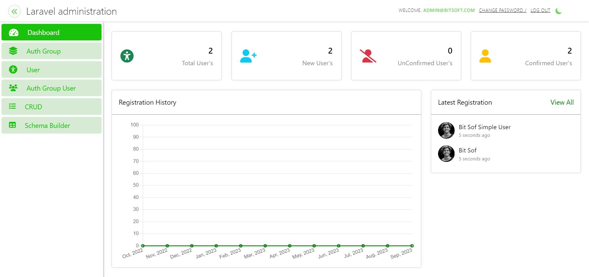

# Laravel Administration


[](https://packagist.org/packages/laravel/framework)
[](https://packagist.org/packages/laravel/framework)
[](https://opensource.org/licenses/MIT)

## About Laravel Administration

Laravel Administration is a powerful package designed to simplify the development of Laravel applications by automating common CRUD (Create, Read, Update, Delete) operations. With this package, you can create models effortlessly and enjoy automatic route generation, views, and controller logic.

## Features

- Automatic CRUD operations.
- RESTful API generation.
- Easy-to-use schema builder for advanced customization.
- User authentication and role management.
- MIT-licensed open-source software.

## Installation Guide

To get started with Laravel Administration, follow these steps:

0. **Create a Laravel Project**:

   ```sh
   composer create-project laravel/laravel LaravelAdministration

1. **Install LaravelAdministration Package**:

    Install the LaravelAdministration package using Composer:

   ```sh
   composer require bitsoftsol/laravel-administration

2. **Add LaravelAdminServiceProvider**:

    Open the `config/app.php` file and add the LaravelAdministration service provider to the `providers` array:

   ```php
   'providers' => [
       // ...
       Bitsoftsol\LaravelAdministration\LaravelAdminServiceProvider::class,
   ],

3. **Publish Vendor Files**:

    Run the following Artisan command to publish vendor files:
    Select the `LaravelAdminServiceProvider` when prompted.

   ```sh
   php artisan vendor:publish

4. **Install Frontend Assets**:

    Run the following commands to build assets:

   ```sh
   npm install
   npm run dev

5. **Set Database Connection**:

    Configure your database connection by setting the database name in your `.env` file.

6. **Run Migrations**:

    Execute the database migrations and seed data:

   ```sh
   php artisan migrate --seed

7. **Enable Authentication Routes**:

    Add the following line inside your `routes/web.php` file:

   ```php
   Auth::routes();

8. **Serve Your Project**:

    Serve your Laravel project:

   ```sh
   php artisan serve

9. **Access Laravel Administration**:

    Open your browser and access the URL `(host)/admin` (e.g., `http://127.0.0.1:8000/admin`).

10. **Login Credentials**:

    Use the following credentials to log in:
       + Username: admin@bitsoftsol.com
       + Password: bitsoftsol123

11. **Create a Superuser**:

    To create a superuser for your Laravel application, follow these steps:

     * Open your terminal and navigate to the root directory of your Laravel project.
   
     * Run the following command:
   
      ```sh
      php artisan createsuperuser
     
The `createsuperuser` command will prompt you to provide the following information:

* __Username__: Choose a unique username for the superuser.
* __Email__: Enter the email address associated with the superuser.
* __Password__: Set a secure password for the superuser.
* __Confirm Password__: Re-enter the password for confirmation.

+ After successfully providing the required information, the superuser account will be created.
+ You can now use the provided username and password to log in as the superuser and access the admin privileges.
+ Creating a superuser allows you to manage and control various aspects of your Laravel application with elevated permissions.

12. **Congratulations!**:

    If you can log in and access the Laravel Administration dashboard, congratulations! You have successfully installed Laravel Administration.

## Usage Guide

In this section, we will guide you through performing automatic CRUD operations for the `Seller` model using Laravel Administration.

0. **Generate the Seller Model:**

   Run the following Artisan command to create the `Seller` model along with its migration file:

      ```bash
      php artisan make:model Seller -m

0. **Define Seller Table Fields:**

   Inside the generated migration file, define the `Seller` table fields, including `name`, `email`, `city`, `country`, and `profile_image`.

1. **Add LaravelAdmin and LaravelAdminAPI Traits:**

   Inside the generated migration file, define the `Seller` table fields, including `name`, `email`, `city`, `country`, and `profile_image`.
   Enhance the functionality of your `Seller` model by importing the `LaravelAdmin` and `LaravelAdminAPI` traits.
   + Import the `LaravelAdmin` Trait at the top of the `Seller` model class:

      ```php
      use Bitsoftsol\LaravelAdministration\Traits\LaravelAdmin;

   + Import the __`LaravelAdminAPI`__ Trait on top of the __`Seller`__ model class:

      ```php
      use Bitsoftsol\LaravelAdministration\Traits\LaravelAdminAPI;

   + Add these two lines inside the `Seller` model class to include the traits:

      ```php
      use LaravelAdmin;
      use LaravelAdminAPI;

2. **Define Fillable Fields:**

   In the `Seller` model class, ensure that you add the field names to the __`fillable`__ array:
      
      ```php
      protected $fillable = [ "name", "email", "city", "country", "profile_image" ];

3. **Run Migrations:**

   Execute the migration to create the __`sellers`__ table in your database:
      
      ```bash
      php artisan migrate

4. **Access the Admin Panel:**

   Open your web browser and visit __`http://127.0.0.1:8000/admin`__. This is where you can manage your sellers with CRUD operations.

5. **Congratulations!**

   You are now able to perform CRUD operations on the __`Seller`__ model without the need for extensive coding.

   This guide empowers you to efficiently manage your sellers in your Laravel application.
   

## Postman Guide

To use CRUD APIs for the `Seller` model, follow these steps:

1. **Import the Postman Collection:**

   Import the provided Postman collection to access the CRUD APIs efficiently. You can download it from here: [Postman Collection - Laravel Administration](src/readme-assets/postman/Laravel-Administration.postman_collection.json).

2. **Import the Environment Variables:**

   Import the environment variables configuration into Postman for seamless testing. You can download it from here: [Postman Environment - Laravel Administration](src/readme-assets/postman/Laravel-Administration.postman_environment.json).

3. **Set the Host Variable:**

   In Postman, configure the `host` variable to match your application's URL, typically something like `http://127.0.0.1:8000`.

4. **Access the Login API:**

   Make a POST request to the following API endpoint to log in:

   - **API Endpoint:** `(host)/api/admin/login`
   - **Credentials:**
     - **Username:** admin@bitsoft.com
     - **Password:** bitsoft123

   After a successful login, you will receive an authentication token.

5. **Set the Token Environment Variable:**

   Once you receive the authentication token upon login, set it as the `(token)` environment variable in Postman for subsequent API requests.

6. **Fetch the Model ID:**

   Retrieve the `model_id` for the `Seller` model from the following API endpoint:

   - **API Endpoint:** `{{host}}/api/admin/crud/models`

   Set the obtained `model_id` as the `(model_id)` environment variable in Postman.

7. **Access CRUD APIs for the Seller Model:**

   You can now access the CRUD APIs for the `Seller` model using the environment variables:

   - **Listing of Seller API:** `{{host}}/api/admin/crud/{{model_id}}`
   - **Detail of Seller API:** `{{host}}/api/admin/crud/{{model_id}}/2` (where 2 represents the seller's ID)
   - **Store Seller API:** `{{host}}/api/admin/crud/{{model_id}}`
   - **Update Seller API:** `{{host}}/api/admin/crud/{{model_id}}` (include the seller's ID in the form-data within the body tab of Postman)
   - **Delete Seller API:** `{{host}}/api/admin/crud/{{model_id}}/3` (where 3 represents the seller's ID)

8. **Congratulations!**

   You can now perform CRUD operations on the `Seller` model without the need for additional coding. Enjoy the convenience of Laravel Administration for managing your sellers efficiently.

## Schema Builder

In the Laravel Administration application, you can effortlessly create the `Seller` model and its associated migration file using the Schema Builder. Here's how:

1. Access the Schema Builder:
   - Navigate to `(host)/admin/crud-schema/create` in your web browser, replacing `(host)` with your application's URL.

2. Enter the Model Name:
   - On the provided page, input 'Seller' as the model name.

3. Submission:
   - Click the 'Submit' button to initiate the generation of the `Seller` model and its corresponding migration file in your project.

Upon successful creation, you'll be redirected to the Schema Builder list. Here, you can find the 'Seller' model in the list.

### Managing Your Schema

- **Deleting Schema:**
  - To remove the 'Seller' model and its migration file from your project, click the 'Delete' button.

- **Defining Schema Fields:**
  - By clicking the 'Create Schema' button, you'll access a view where you can define the fields of the 'Seller' migration, including the ability to add more fields. If you wish to include image fields in the migration, ensure you suffix column names with '_image.'

- **LaravelAdmin Trait:**
  - On the 'Create Schema' view, you can select whether to use the 'LaravelAdmin' Trait by ticking the checkbox. If chosen, the trait will be automatically imported when defining seller field names.

### Editing Schema

After creating the schema, you'll find an 'Open Editor' button in the 'Seller' row within the Schema Builder listing. Clicking this button will redirect you to a Visual Code Editor view, allowing you to edit the 'Seller' migration and model files.

- **LaravelAdminAPI and LaravelAdmin Traits:**
  - In the live editor, you can use the 'LaravelAdminAPI' Trait if required, and include the 'LaravelAdmin' Trait if desired. These traits will enable you to access CRUD routes for the Seller model, both through web and API interfaces.

- **Defining Fillable Fields:**
  - Set the fields of the 'sellers' table in the `fillable` array. These fields will be displayed in the Seller listing view.

### Migration

After editing the model and migration files, you can click on the 'Migrate' button to apply the changes to your table. Once the seller table is migrated, you will no longer be able to open the editor or perform migrations, but you can still delete.

### CRUD Operations

- **LaravelAdmin Trait:**
  - If you have included the 'LaravelAdmin' Trait in your Seller model, you can access Seller CRUD operations via the 'CRUD' tab on the web interface.

- **LaravelAdminAPI Trait:**
  - If you have included the 'LaravelAdminAPI' Trait in your Seller model, you can access Seller CRUD operation APIs using the Postman Collection.


